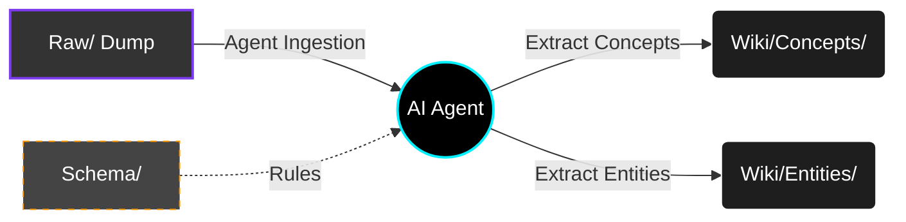

# 🧠 Agentic LLM-Wiki Template

[](https://obsidian.md/)
[](#)

> **Your AI's Second Brain.** A carefully structured Obsidian vault designed to act as a shared, permanent memory layer for you and your AI assistants.

The core reason for building an LLM-Wiki is to solve the problem of AI tools losing context or working in isolation. By giving your agents a unified knowledge graph powered by structured data, they can continuously learn, store, and retrieve information alongside you without ever forgetting the important details.

### The Solution: A Structured Memory Layer
To make this work seamlessly, this vault separates your messy, unstructured thoughts from polished, verified knowledge:
- **Raw Input:** Your AI ingests raw documents, articles, and messy notes.
- **Schema Enforcement:** Simple rules provide AI agents with the exact structure they need to autonomously categorize concepts.
- **Polished Knowledge:** The result is a clean, organized, and powerful personal wiki that your AI can maintain and explore for you, preventing chaos.

---

## ✨ Features

* **🛡️ Privacy-First & Local AI Ready:** Designed to work perfectly with local LLMs, keeping your personal embeddings and thoughts secure on your machine.
* **📂 Structured Knowledge Base:** Strict separation of `Raw/` sources from compiled `Wiki/` knowledge.
* **🤖 Agent Skills Included:** Comes pre-configured with a `.agents/` folder containing specialized skills (`llm-wiki-ingest`, `llm-wiki-lint`, `llm-wiki-query`).
* **📏 Schema Enforcement:** Defined frontmatter schemas and linting checklists to keep your knowledge base perfectly organized.
* **⚙️ Automated Python Utilities:** Built-in scripts for managing large files, fixing schemas, and auditing the vault.

---

## 🚀 Getting Started

### 1. Clone the Repository
Download this repository to your local machine:
```bash
git clone https://github.com/pokharelsandeep333-commits/Personal-Wiki-Template.git
```

### 2. Open in Obsidian
1. Download and install [Obsidian](https://obsidian.md/).
2. Open Obsidian and select **"Open folder as vault"**.
3. Select the folder you just cloned.

### 3. Install Python Dependencies (Optional)
> [!NOTE]
> If you plan to use the automation scripts in the `scripts/` folder (like the PDF watcher), you will need Python installed. 

Install the dependencies by running:
```bash
pip install -r requirements.txt
```

### 4. Smart Plugins & AI Capabilities
This template is configured to use advanced AI community plugins (such as **Smart Connections**, **Smart Context**, and **Smart ChatGPT**). 

For security reasons, the plugin files are **not** bundled in this repository. You must install them manually:

1. Open Obsidian **Settings** > **Community Plugins**.
2. Turn off "Safe Mode" if prompted.
3. Click **Browse** and search for the following plugins, then **Install** and **Enable** them:
   - `Smart Connections`
   - `Smart Context`
   - `Smart ChatGPT`
   - `Local REST API` (if you are using local LLM agents)

> [!CAUTION]
> **Protect Your Embeddings:** Once enabled, the Smart plugins will automatically generate a `.smart-env` folder in your vault containing your local vector embeddings. **Do not commit this folder to a public repository!** The provided `.gitignore` handles this automatically, but always double-check before pushing.

---

## 📂 Architecture & Workflow

This Wiki uses a strict **Raw → Wiki** pipeline to maintain high-quality knowledge.



* **`Raw/`**: Your dumping ground. Put raw PDFs, articles, web clippings, and rough thoughts here.
* **`Wiki/`**: The compiled, polished truth. AI agents read your `Raw` files and extract entities, concepts, and topics into the `Wiki`.
* **`Schema/`**: The rulebook for how notes should be formatted. Agents read this before making changes.

### Example Workflow
1. **Save a source:** Save an article to `Raw/Sources/My Article.md`.
2. **Command your Agent:** Ask your AI assistant to "Ingest 'My Article.md'".
3. **Review:** The agent processes the source, extracts core ideas, and generates perfectly formatted files in `Wiki/Concepts/` and `Wiki/Entities/`.
4. **Explore:** Everything is interlinked automatically using Obsidian's `[[wikilinks]]`.

*(We've included an `Agentic Workflows` concept and an `Example Source` in the vault so you can see how they are structured!)*

---

## 🤖 Using the Agent Skills

If you use AI IDEs or CLI agents that support the standard `.agents` specification, this repository is ready out of the box. 

When your agent opens this directory, it will automatically load the skills in the `.agents/` folder, teaching it exactly how to ingest, lint, and query this specific Wiki structure without you needing to explain it!

**Example Usage:**
Simply tell your AI assistant:
> *"Run `llm-wiki-lint` to check if my new notes follow the schema."*

OR

> *"Please ingest the new PDF I dropped in the Raw folder using the `llm-wiki-ingest` skill."*
